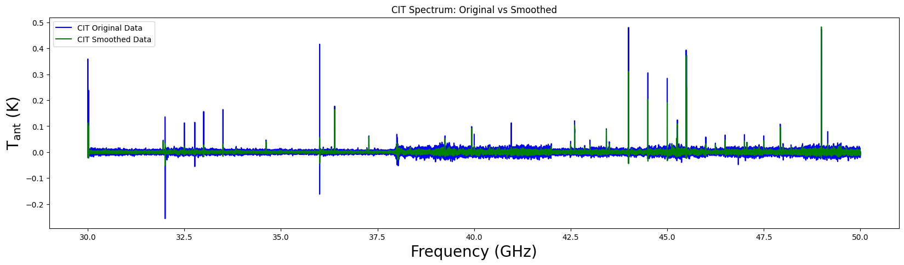
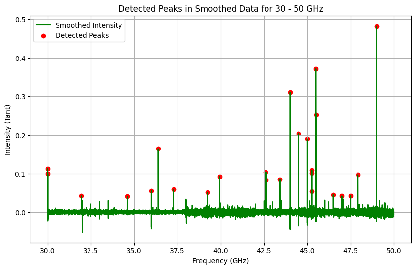
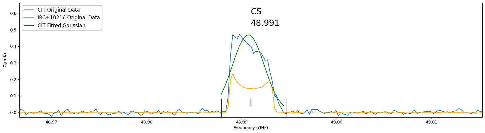
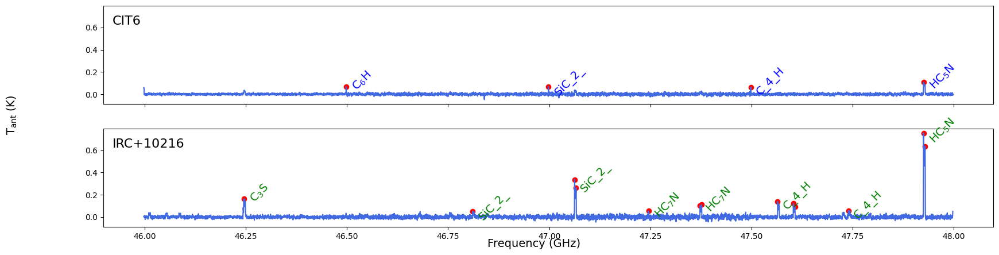
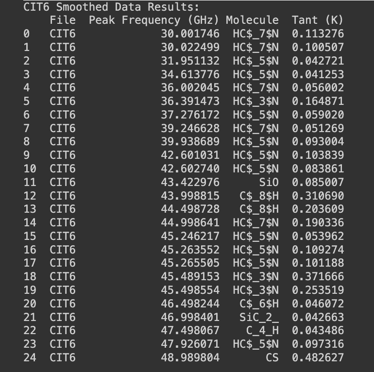

# Carbon-Star-Analysis
Radio Spectroscopical analysis of Carbon Stars [CIT6](https://en.wikipedia.org/wiki/CIT_6) and [CW Leonis](https://en.wikipedia.org/wiki/CW_Leonis) (aka IRC+10216)

## Table of Contents
- [Features](#Features)
- [Installation](#installation)
- [Usage](#usage)
- [Data Processing](#data-processing)
- [Smoothing and Gaussian Fitting](#smoothing-and-gaussian-fitting)
- [Peak Detection and Classification](#peak-detection-and-classification)
- [Visualization](#visualization)
- [Contributing](#contributing)
- [License](#license)


## Features

This project offers a range of tools for analyzing and visualizing radio spectroscopic data of stellar bodies, with the following features:

- **Peak Detection and Classification:** Automatically detects peaks in the spectroscopic data and classifies them by matching the detected peaks with known molecular transitions.

- **Smoothing Spectral Data:** Applies a Savitzky-Golay filter to smooth the Tant (antenna temperature measured in K) data for both CIT6 and CW Leonis, helping to reduce noise and improve clarity in peak detection.

- **Gaussian Fitting:** Fits a Gaussian model to zoomed-in sections of CIT6 spectral data, allowing precise modeling of spectral lines and better visualization of the line profiles.

- **Dual-Dataset Comparisons:** Provides tools to compare and visualize spectral data from both CIT6 and CW Leonis, plotting the data side by side for easy comparison.

- **Annotation and Visualization:** Annotates detected peaks with molecular names in the plots, making it easy to identify the molecules responsible for each spectral line. Both the original and smoothed data can be plotted for CIT6 and CW Leonis.

- **Data Handling and Export:** Processes multiple spectroscopic data files and outputs the results in `pandas` DataFrames, including peak frequencies, associated molecules, and integrated intensities (Tint).


### Installation 

To use the code within this repository you will need to install the following libraries:

```python
!pip install numpy pandas matplotlib astropy scipy specutils
```

If you're running the code in Google Colab, you can mount Google Drive using:
 ```python
from google.colab import drive
drive.mount('/content/drive/')
%cd /content/drive/MyDrive
```

## Usage

Load the spectral line data for both CIT6 and CW Leonis:
```python
molecule_data = pd.read_excel('detectedline_table.xlsx', sheet_name='CIT6')
molecule_data['Rest Frequency'] = molecule_data['Rest Frequency'].astype(float) / 1000.  # Convert MHz to GHz
```

## Data Processing

The spectral data is loaded using pd.read_csv and concatenated for further analysis:
```python
pathlist = sorted(Path('data/Apr3/CIT6Apr3/').glob('*.txt'))
cit_spec = pd.DataFrame()
for path in pathlist:
    ind_spec = pd.read_csv(path, sep='\s+', names=['order', 'freq', 'Tant'])
    cit_spec = pd.concat([cit_spec, ind_spec])
cit_spec = cit_spec.sort_values(by='freq')
```

## Smoothing and Gaussian Fitting

Smoothing is applied to the Tant data using a Savitzky-Golay filter:
```python
cit_spec['Tant_smoothed'] = savgol_filter(cit_spec['Tant'], window_length=11, polyorder=2)
```
Both original and smoothed data are plotted, allowing comparison:
```python
plt.plot(cit_spec['freq'], cit_spec['Tant'], label="CIT Original Data", color='blue')
plt.plot(cit_spec['freq'], cit_spec['Tant_smoothed'], label="CIT Smoothed Data", color='green')
```


The smoothed data is then used for peak detection and Gaussian fitting:
```python
fitted_cit_gaussian = fit_gaussian_for_section(np.array(freq_list), np.array(Tant_cit_list))
```


The "measure_Tint_with_gaussian_fit" function fits a Gaussian model to the CIT6 data and overlays the results onto the original spectrum:
```python
measure_Tint_with_gaussian_fit(rest_freq, mol, cit_spec, irc_spec)
```


## Peak Detection and Classification

The code detects peaks in intensity and classifies them by matching detected peaks to known molecular rest frequencies:
```python
peaks, _ = find_peaks(ind_spec['Tant'], height=0.05, distance=5, prominence=0.05)
peak_freqs = ind_spec['freq'].iloc[peaks].values
```

Molecular classification is performed by finding the closest rest frequency in the dataset
```python
molecule_row = molecule_data.iloc[(molecule_data['Rest Frequency'] - peak_freq).abs().argmin()]
molecule_name = molecule_row['Molecule']
```


Results are stored in a DataFrame for both CIT6 and CW Leonis
```python
df_classified_peaks = process_files_to_dataframe('data/Apr3/CIT6Apr3/', height=0.05, distance=5, prominence=0.05)
```

